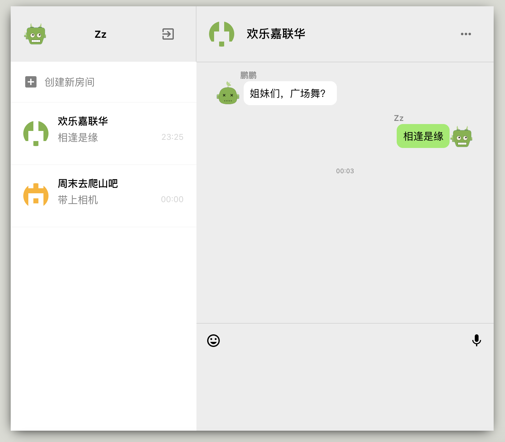
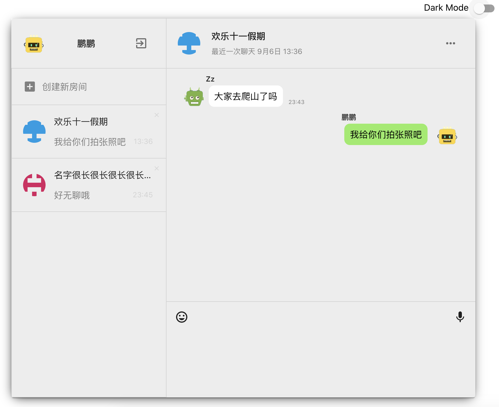
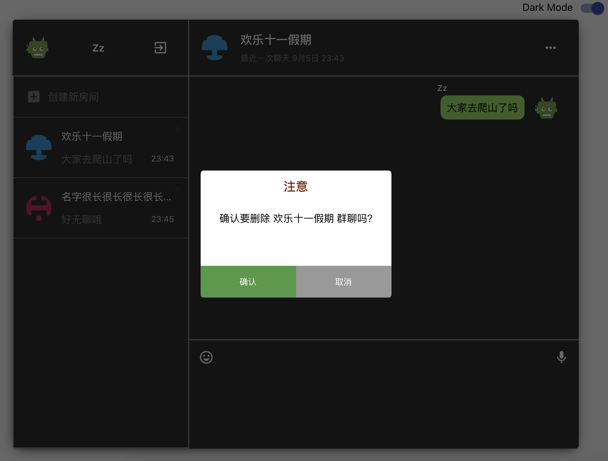
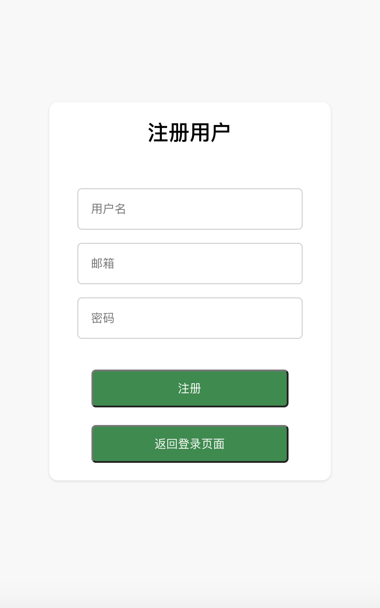
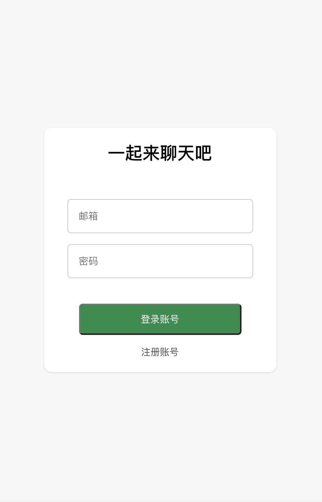

### Intro

This is a real-time chat application developed in react.

### New features
- Add loading component for full page
- Add dark theme
- Custom modal component to display small window information
- Keep signin status  
- User can delete chat room
- Allow user signout
- Allow user login, register with email and password
- Allow create new chatting room 
- Random cute avatar based on user's name
- Real-time group chat 
- Responsive layout on web

### Built with

- React JS, React Context API, Hooks, React Router
- Database: Firebase Firestore Realtime Database
- UI:  Material UI, CSS3

### DEMO

**If you like my project, please give me a star!**